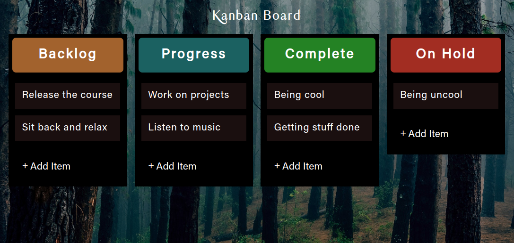

# DRAG AND DROP

- Keep track of Tasks
- Divided into columns: Backlog, In Progress, Complete, On Hold
- Tasks in each column need to be able to be moved between columns and edited
- Main goal of this project is to showcase the drag and drop API. It allows us to drag and drop any html element and move it inside another html element

Live - https://overdrivemachines.github.io/drag-and-drop/

## References

- Fonts - https://tympanus.net/Development/ScrollPanels/
- Drag and Drop - https://www.w3schools.com/html/html5_draganddrop.asp
- ondragenter - https://www.w3schools.com/tags/att_ondragenter.asp
- Events fired on the draggable target (the source element):

  - ondragstart - fires when the user starts to drag an element
  - ondrag - fires when an element is being dragged
  - ondragend - fires when the user has finished dragging the element

- Events fired on the drop target:
  - ondragenter - fires when the dragged element enters the drop target
  - ondragover - fires when the dragged element is over the drop target
  - ondragleave - fires when the dragged element leaves the drop target
  - ondrop - fires when the dragged element is dropped on the drop target
